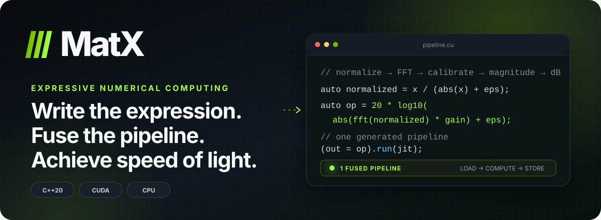
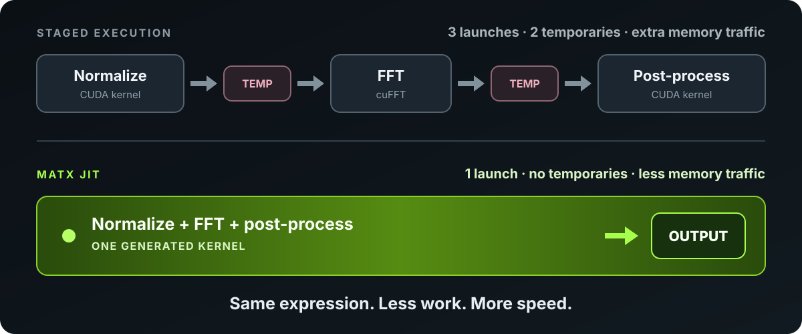

<div align="center">
  
</div>

<div align="center">

[](https://github.com/NVIDIA/MatX/releases)
[](LICENSE)
[](https://nvidia.github.io/MatX)
[](https://coveralls.io/github/NVIDIA/MatX?branch=main)

**Python-like tensor expressions. C++ control. NVIDIA GPU speed.**

[Get started](#get-running) · [Read the docs](https://nvidia.github.io/MatX) · [Explore examples](examples) · [Join the discussion](https://github.com/NVIDIA/MatX/discussions)

</div>

MatX is a C++20 library for numerical computing on NVIDIA GPUs and CPUs. It turns readable tensor expressions into efficient execution plans, calling optimized libraries when appropriate and generating fused kernels when it can.

## A signal pipeline. One fused kernel.

```cpp
#include <matx.h>

constexpr matx::index_t batches = 256;
constexpr matx::index_t samples = 4096;

auto signal      = matx::make_tensor<matx::fcomplex>({batches, samples});
auto calibration = matx::make_tensor<float>({batches, samples});
auto spectrum_db = matx::make_tensor<float>({batches, samples});

auto normalized_signal = signal / (matx::abs(signal) + 1.0e-6f);
auto pipeline = 20.0f * matx::log10(
  matx::abs(matx::fft(normalized_signal) * calibration) + 1.0e-6f);

(spectrum_db = pipeline).run(matx::CUDAJITExecutor{});
```

This reads like the algorithm: normalize every complex input sample, transform every batch, apply frequency-domain calibration, compute magnitude, and convert the result to decibels. With `-DMATX_EN_MATHDX=ON` and a supported FFT shape, MatX lowers the compatible pipeline into **one generated kernel**—no normalized-input or FFT temporary, and no separate pre- or post-processing launch. The same expression can use `cudaExecutor` for the broader optimized, non-JIT CUDA path.

<div align="center">
  
</div>

For memory-bound workloads, eliminating launches and intermediate reads and writes lets a simple expression reach **speed-of-light performance** without hand-writing CUDA kernel plumbing.

**Measured below: the short MatX CUDA expression stays within about 3% of handwritten CUDA + cuFFT, while the identical expression with JIT fusion runs 1.61× faster.**

> Actual performance depends on the operation, shape, data type, and target GPU. Profile on your hardware; MatX makes the fast path concise, not mysterious.

## JIT fusion crosses library boundaries

`CUDAJITExecutor` can fuse supported transforms and their surrounding operators into a single runtime-generated kernel. With `-DMATX_EN_MATHDX=ON`, compatible paths include:

| | What can join the expression |
|---|---|
| **cuFFTDx** | 1D FFTs and supported single-block 2D complex FFTs |
| **cuBLASDx** | Compatible matrix multiplication and GEMM paths |
| **cuSolverDx** | Cholesky, inverse, and selected LU, QR, and eigensolver projections |
| **cuRANDDx** | Small floating-point and complex random expressions |

JIT kernel fusion is experimental and intentionally rejects unsupported combinations rather than silently changing the execution model. See the [fusion guide](https://nvidia.github.io/MatX/basics/fusion.html) for the current support matrix, constraints, and compile-cache behavior.

## Near handwritten CUDA. Then fuse it to go faster.

The reproducible, commented [FFT benchmark example](examples/fft_benchmark.cu) always compares handwritten CUDA + cuFFT with MatX `cudaExecutor`. Enable MathDx to add the JIT case:

1. Handwritten CUDA normalization and post-processing kernels around a batched cuFFT plan.
2. One MatX expression with `cudaExecutor`, which uses cuFFT plus generated normalization and post-processing kernels.
3. **The exact same MatX expression** with `CUDAJITExecutor`, which fuses both sides of the FFT through cuFFTDx.

**MatX's concise CUDA path lands within about 3% of the handwritten implementation. Changing only the executor then makes that same expression 1.61× faster.**[^fft-platform]

| Implementation | Median time | Throughput | vs. CUDA + cuFFT |
|---|---:|---:|---:|
| CUDA kernels + cuFFT | 0.1792 ms | 5.851 Gsample/s | 1.00× |
| MatX `cudaExecutor` | 0.1848 ms | 5.675 Gsample/s | 0.97× |
| MatX `CUDAJITExecutor` | **0.1114 ms** | **9.413 Gsample/s** | **1.61×** |

The JIT path removes roughly **68 µs—or 38%—from every pipeline execution**. The timed handwritten path requires two custom kernels plus explicit FFT planning, two temporary tensors, launch geometry, stream wiring, and error handling:

**CUDA + cuFFT**

```cpp
__global__ void NormalizeKernel(/* ... */) { /* magnitude + complex divide */ }
__global__ void MagnitudeDbKernel(/* ... */) { /* calibrate + magnitude + dB */ }

cufftComplex *normalized;
cufftComplex *fft_output;
cudaMalloc(&normalized, count * sizeof(cufftComplex));
cudaMalloc(&fft_output, count * sizeof(cufftComplex));
cufftPlanMany(&plan, 1, size, /* layout... */, CUFFT_C2C, batches);
cufftSetStream(plan, stream);

NormalizeKernel<<<blocks, threads, 0, stream>>>(normalized, signal, count);
cufftExecC2C(plan, normalized, fft_output, CUFFT_FORWARD);
MagnitudeDbKernel<<<blocks, threads, 0, stream>>>(
    output, fft_output, calibration, count);
```

The two MatX versions share the same readable expression. **Only the executor changes:**

**MatX CUDA and JIT**

```cpp
auto normalized_signal = signal / (matx::abs(signal) + 1.0e-6f);
auto pipeline = 20.0f * matx::log10(
  matx::abs(matx::fft(normalized_signal) * calibration) + 1.0e-6f);

// cuFFT performance with far less code
(spectrum_db = pipeline).run(matx::cudaExecutor{stream});

// Same expression, now fused into one kernel
(spectrum_db = pipeline).run(matx::CUDAJITExecutor{stream});
```

The table reports the median of five benchmark executions. Each execution uses one stream, cached plans, 10 warmups, 2,000 iterations per trial, and seven interleaved trials. Both MatX paths stayed within the benchmark's relative-error tolerance. Online JIT compilation is measured separately and excluded from steady-state timing because its cost depends heavily on the local compile cache.

To reproduce the comparison on your GPU:

```bash
cmake -S . -B build \
  -DCMAKE_BUILD_TYPE=Release \
  -DMATX_BUILD_EXAMPLES=ON \
  -DMATX_EN_MATHDX=ON
cmake --build build --target fft_benchmark -j
./build/examples/fft_benchmark 256 4096 2000
```

`fft_benchmark` is built with the other examples whenever `MATX_BUILD_EXAMPLES=ON`. The JIT case is compiled only with `MATX_EN_MATHDX=ON`. If MatX is configured with `MATX_EN_NVPL=ON` or `MATX_EN_X86_FFTW=ON`, the example also compiles and reports the identical expression through the multithreaded `AllThreadsHostExecutor`. That optional CPU result is printed separately from the GPU cases.

Performance depends on GPU, clocks, shape, and software versions; use the benchmark rather than assuming this ratio for every workload.

[^fft-platform]: Measured with 256 batched 4096-point complex FP32 FFTs on an NVIDIA GB10 using CUDA 13.0 and MathDx 26.03.

## Write the math. Keep native control.

| Expressive | Composable | Deployable |
|---|---|---|
| NumPy- and MATLAB-inspired syntax | Elementwise math, reductions, FFTs, BLAS, solvers, signal processing, and more | Header-only C++20 with CUDA and optimized, multithreaded host executors |
| Arbitrary-rank tensors and lightweight views | Slice, clone, permute, broadcast, and batch without changing the algorithm | Integrates through CMake and interoperates with existing memory and streams |
| Lazy generators avoid unnecessary storage | Store and reuse expressions without giving up fusion | Supports Volta, Ampere, Ada, Hopper, and Blackwell GPUs |

```cpp
// Generators and arithmetic become one elementwise kernel—no temporary ranges.
(x = matx::ones<float>(x.Shape())
   + matx::linspace(1.0f, 100.0f, x.Size(0)) * 5.0f).run(exec);

// Higher dimensions are batches: the expression stays the same.
(spectrum = matx::fft(signal) * window).run(exec);

// Change the execution target, not the expression.
(y = matx::sin(x) + 0.5f).run(matx::AllThreadsHostExecutor{});
```

## GPU acceleration and optimized host execution

MatX is not GPU-only. The same operator model runs on CPUs, and `AllThreadsHostExecutor` uses OpenMP—when enabled by a CPU backend—to distribute supported work across the available host threads:

```cpp
matx::AllThreadsHostExecutor host{};
(spectrum_db = pipeline).run(host);
```

Host transforms dispatch to optimized CPU libraries when their corresponding CMake option is enabled:

| Backend | Optimized host operations | Enable with |
|---|---|---|
| **NVIDIA NVPL** | FFT, BLAS, and LAPACK on NVIDIA Arm CPUs | `-DMATX_EN_NVPL=ON` |
| **FFTW** | FFT on x86 CPUs | `-DMATX_EN_X86_FFTW=ON` |
| **OpenBLAS** | BLAS and LAPACK on x86 CPUs | `-DMATX_EN_OPENBLAS=ON` |
| **BLIS** | BLAS on x86 CPUs | `-DMATX_EN_BLIS=ON` |

All elementwise operators and reductions have host paths, as do FFT, BLAS, and LAPACK transforms when the relevant backend is configured. Most host functions support multithreading; reductions and a small set of transforms currently remain single-threaded. See [executor compatibility](https://nvidia.github.io/MatX/executor_compatibility.html) for the operation-by-operation breakdown.

## Performance that scales down to one line

In the project's FFT resampler comparison, nearly identical high-level algorithms produced the following end-to-end runtimes:

| NumPy / Xeon E5-2698 v4 | CuPy / NVIDIA A100 | MatX / NVIDIA A100 |
|---:|---:|---:|
| **5360 ms** | **10.6 ms** | **2.54 ms** |

That run measured MatX at **more than 4× faster than CuPy on the same GPU** and roughly **2100× faster than the NumPy CPU implementation**. These results are from the existing reference comparison and are hardware- and workload-specific; they illustrate the payoff of keeping a high-level algorithm while removing framework and intermediate-memory overhead.

## Get running

MatX is header-only. Add the repository to your project and link its interface target:

```cmake
cmake_minimum_required(VERSION 3.30.4)
project(my_app LANGUAGES CXX CUDA)

add_subdirectory(path/to/MatX)

add_executable(my_app main.cu)
target_link_libraries(my_app PRIVATE matx::matx)
```

Then include the API:

```cpp
#include <matx.h>
```

To build MatX examples and tests locally:

```bash
cmake -S . -B build \
  -DMATX_BUILD_EXAMPLES=ON \
  -DMATX_BUILD_TESTS=ON
cmake --build build -j
ctest --test-dir build
```

MatX currently targets Linux and requires a C++20 build environment. GPU builds require the CUDA Toolkit and a supported host compiler; consult the [build guide](https://nvidia.github.io/MatX/build.html) for exact current versions, optional backends, offline setup, and CPU support.

## Choose your next step

| I want to… | Go here |
|---|---|
| Learn the tensor and expression model | [Quick start](https://nvidia.github.io/MatX/quickstart.html) |
| Understand kernel fusion | [Fusion guide](https://nvidia.github.io/MatX/basics/fusion.html) |
| Translate familiar array syntax | [MATLAB / Python syntax guide](https://nvidia.github.io/MatX/basics/matlabpython.html) |
| Check executor support | [Executor compatibility](https://nvidia.github.io/MatX/executor_compatibility.html) |
| Learn interactively | [Self-guided notebooks](docs_input/notebooks) |
| Start from working applications | [Examples](examples) |

## Community

- Ask usage questions in [GitHub Discussions](https://github.com/NVIDIA/MatX/discussions).
- Report bugs and request features through [GitHub Issues](https://github.com/NVIDIA/MatX/issues/new/choose).
- Read [CONTRIBUTING.md](CONTRIBUTING.md) before submitting a change.
- MatX uses semantic versioning and is available under the [BSD 3-Clause license](LICENSE).
