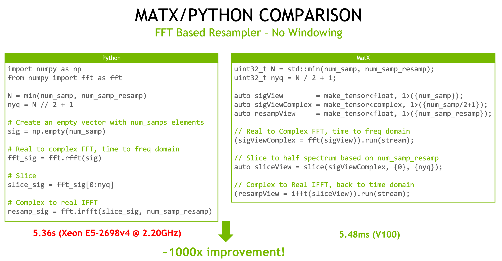

# MatX - GPU-Accelerated Numerical Computing in Modern C++

[](https://github.com/NVIDIA/MatX/releases/)
[](https://github.com/NVIDIA/MatX/blob/main/LICENSE)
[](https://nvidia.github.io/MatX)
[](https://coveralls.io/github/NVIDIA/MatX?branch=main)

**MatX** is a modern C++ library for numerical computing on NVIDIA GPUs and CPUs. Near-native performance can be achieved while using a simple syntax common in higher-level languages such as Python or MATLAB.



The above image shows the Python (Numpy) version of an FFT resampler next to the MatX version. The total runtimes of the NumPy version, CuPy version,
and MatX version are shown below:

* Python/Numpy: **5360ms** (Xeon(R) CPU E5-2698 v4 @ 2.20GHz)
* CuPy: **10.6ms**  (A100)
* MatX: **2.54ms** (A100)

While the code complexity and length are roughly the same, the MatX version shows a **2100x** over the Numpy version, and over **4x** faster than
the CuPy version on the same GPU. 

Key features include:

* :zap: MatX is fast. By using existing, optimized libraries as a backend, and efficient kernel generation when needed, no hand-optimizations
are necessary

* :open_hands: MatX is easy to learn. Users familiar with high-level languages will pick up the syntax quickly

* :bookmark_tabs: MatX easily integrates with existing libraries and code

* :sparkler: Visualize data from the GPU right on a web browser

* :arrow_up_down: IO capabilities for reading/writing files


## Table of Contents
* [Requirements](#requirements)
* [Installation](#installation)
    * [Building MatX](#building-matx)
    * [Integrating MatX With Your Own Projects](#integrating-matx-with-your-own-projects)
* [Documentation](#documentation)
    * [Supported Data Types](#supported-data-types)
* [Unit Tests](#unit-tests)
* [Quick Start Guide](#quick-start-guide)
* [Release History](#release-history)
* [Filing Issues](#filing-issues)
* [Contributing Guide](#contributing-guide)


## Requirements
MatX support is currently limited to **Linux only** due to the time to test Windows. If you'd like to voice your support for native Windows support using Visual Studio, please comment on the issue here: https://github.com/NVIDIA/MatX/issues/153.

**Note**: CUDA 12.0.0 through 12.2.0 have an issue that causes building MatX unit tests to show a compiler error or cause a segfault in the compiler. Please use CUDA 11.8 or CUDA 12.2.1+ with MatX.

MatX is using features in C++17 and the latest CUDA compilers and libraries. For this reason, when running with GPU support, CUDA 11.8 and g++9, nvc++ 24.5, or clang 17 or newer is required. You can download the CUDA Toolkit [here](https://developer.nvidia.com/cuda-downloads).

MatX has been tested on and supports Pascal, Turing, Volta, Ampere, Ada, and Hopper GPU architectures. Jetson products are supported with Jetpack 5.0 or above.

The MatX build system when used with CMake will automatically fetch packages from the internet that are missing or out of date. If you are on a machine without internet access or want to manage the packages yourself, please follow the [offline instructions](https://nvidia.github.io/MatX/build.html#matx-in-offline-environments) 
and pay attention to the [required versions of the dependencies](https://nvidia.github.io/MatX/build.html#required-third-party-dependencies).

**Note for CPU/Host support**: CPU/Host execution is considered beta. Only operator execution is supported right now, but no functions that require libraries (FFT/GEMM, etc). If you find a bug in an operator on CPU, please report it in the issues above. 


## Installation
MatX is a header-only library that does not require compiling for using in your applications. However, building unit tests, benchmarks, 
or examples must be compiled. CPM is used as a package manager for CMake to download and configure any dependencies. If MatX is to
be used in an air-gapped environment, CPM [can be configured](https://github.com/cpm-cmake/CPM.cmake#cpm_source_cache) to search locally for files.
Depending on what options are enabled, compiling could take very long without parallelism enabled. Using the ``-j`` flag on ``make`` is
suggested with the highest number your system will accommodate. 

### Building MatX
To build all components, issue the standard cmake build commands in a cloned repo:

```sh
mkdir build && cd build
cmake -DMATX_BUILD_TESTS=ON -DMATX_BUILD_BENCHMARKS=ON -DMATX_BUILD_EXAMPLES=ON -DMATX_BUILD_DOCS=OFF ..
make -j
```

By default CMake will target the GPU architecture(s) of the system you're compiling on. If you wish to target other architectures, pass the
`CMAKE_CUDA_ARCHITECTURES` flag with a list of architectures to build for:

```sh
cmake .. -DCMAKE_CUDA_ARCHITECTURES="80;90"
```

By default nothing is compiled. If you wish to compile certain options, use the CMake flags below with ON or OFF values:

```
MATX_BUILD_TESTS
MATX_BUILD_BENCHMARKS
MATX_BUILD_EXAMPLES
MATX_BUILD_DOCS
```

For example, to enable unit test building:
```sh
mkdir build && cd build
cmake -DMATX_BUILD_TESTS=ON ..
make -j
```

### Integrating MatX With Your Own Projects
MatX uses CMake as a first-class build generator, and therefore provides the proper config files to include into your own project. There are
typically two ways to do this: 
1. Adding MatX as a subdirectory 
2. Installing MatX to the system

#### 1. MatX as a Subdirectory
Adding the subdirectory is useful if you include the MatX
source into the directory structure of your project. Using this method, you can simply add the MatX directory:

```cmake
add_subdirectory(path/to/matx)
```

An example of using this method can be found in the [examples/cmake_sample_project](examples/cmake_sample_project) directory.

#### 2. MatX Installed to the System
The other option is to install MatX and use the configuration file provided after building. This is typically done in a way similar to what is
shown below:

```sh
cd /path/to/matx
mkdir build && cd build
cmake ..
make && make install
```

If you have the correct permissions, the headers and cmake packages will be installed on your system in the expected paths for your operating
system. With the package installed you can use ``find_package`` as follows:

```cmake
find_package(matx CONFIG REQUIRED)
```

#### MatX CMake Targets
**Once either of the two methods above are done**, you can use the transitive target ``matx::matx`` in your library inside of ``target_link_libraries``, e.g:

```
target_link_libraries(MyProject matx::matx)
```

MatX may add other optional targets in the future inside the matx:: namespace as well.


## Documentation
Documentation for MatX can be built locally as shown above with the `DBUILD_DOCS=ON` cmake flag. Building documentation requires the following to be installed:
doxygen, breathe, sphinx, sphinx-rtd-theme, libjs-mathjax, texlive-font-utils, flex, bison

- Current documentation can be [found here](https://nvidia.github.io/MatX)
- A quick start guide can be [found here](https://nvidia.github.io/MatX/quickstart.html)
- Current library limitations are [listed here](https://nvidia.github.io/MatX/limitations.html)
- A conversion from MATLAB and Python syntax is [found here](https://nvidia.github.io/MatX/matlabpython.html)
- A self-guided Jupyer notebook training can be [found here](docs/notebooks)

MatX uses semantic versioning and reserve the right to introduce breaking API changes on major releases.

### Supported Data Types
MatX supports all types that use standard C++ operators for math (+, -, etc). Unit tests are run against all common types shown below. 

* Integer: `int8_t`, `uint8_t`, `int16_t`, `uint16_t`, `int32_t`, `uint32_t`, `int64_t`, `uint64_t`
* Floating Point: `matxFp16` (fp16), `matxBf16` (bfloat16), `float`, `double`
* Complex: `matxfp16Complex`, `matxBf16Complex`, `cuda::std::complex<float>`, `cuda::std::complex<double>`

Since CUDA half precision types (``__half`` and ``__nv_bfloat16``) do not support all C++ operators on the host side, MatX provides the ``matxFp16`` and
``matxBf16`` types for scalars, and ``matxFp16Complex`` and ``matxBf16Complex`` for complex types. These wrappers are needed so that tensor
views can be evaluated on both the host and device, regardless of CUDA or hardware support. When possible, the half types will use hardware-
accelerated intrinsics automatically. Existing code using ``__half`` and ``__nv_bfloat16`` may be converted to the ``matx`` equivalent types directly
and leverage all operators.


## Unit Tests
MatX contains a suite of unit tests to test functionality of the primitive functions, plus end-to-end tests of example code.
MatX uses [pybind11](https://github.com/pybind/pybind11) to generate some of the unit test inputs and outputs. This avoids
the need to store large test vector files in git, and instead can be generated as-needed.

To run the unit tests, from the cmake build directory run:
```sh
test/matx_test
```

This will execute all unit tests defined. If you wish to execute a subset of tests, or run with different options, you
may run test/matx_test directly with parameters defined by [Google Test](https://github.com/google/googletest). To run matx_test
directly, you must be inside the build/test directory for the correct paths to be set. For example,
to run only tests with the name FFT:

```sh
cd build/test
./matx_test --gtest_filter="*FFT*"
```


## Quick Start Guide
We provide a variety of training materials and examples to quickly learn the MatX API.
- A [quick start guide](docs_input/quickstart.rst) can be found in the docs directory or from the [main documentation site](https://nvidia.github.io/MatX/quickstart.html). The MatX quick start guide is modeled after [NumPy's](https://numpy.org/doc/stable/user/quickstart.html) and demonstrates how to manipulate and create tensors.
- A set of MatX [notebooks](docs_input/notebooks) can be found in the docs directory. These four notebooks walk through the major MatX features and allow the developer to practice writing MatX code with guided examples and questions.
- Finally, for new MatX developers, browsing the [example applications](examples) can provide familarity with the API and best practices.

## Release Major Features
**v0.8.0**:
- *Features*
    * Updated cuTENSOR and cuTensorNet versions
    * Added configurable print formatting
    * ARM FFT support via NVPL
    * New operators: abs2(), outer(), isnan(), isinf()
    * Many more unit tests for CPU tests
- Bug fixes for matmul on Hopper, 2D FFTs, and more
  
**v0.7.0**:
- *Features*
    * Automatic documentation generation
    * Use CCCL instead of CUB/libcudac++
    * New operators: `polyval`, `matvec`
    * Improved caching and teardown of transforms
    * Optimized polyphase resampler
    * Negative slice indexing
- Many new bug fixes and error checking
  
**v0.6.0**:
- Breaking changes
    * This marks the first release of using "transforms as operators". This allows transforms to be used in any operator expression, whereas the previous release required them to be on separate lines. For an example, please see: https://nvidia.github.io/MatX/basics/fusion.html. This also causes a breaking change with transform usage. Converting to the new format is as simple as moving the function parameters. For example: `matmul(C, A, B, stream);` becomes `(C = matmul(A,B)).run(stream);`. 
- *Features*
    * Polyphase channelizer
    * Many new operators, including upsample, downsample, pwelch, overlap, at, etc
    * Added more lvalue semantics for operators based on view manipulation
- Bug fixes
    * Fixed cache issues
    * Fixed stride = 0 in matmul

## Discussions
We have an open discussions board [here](https://github.com/NVIDIA/MatX/discussions). We encourage any questions about the library to be posted here for other users to learn from and read through.

## Filing Issues
We welcome and encourage the [creation of issues](https://github.com/NVIDIA/MatX/issues/new) against MatX. When creating a new issue, please use the following syntax in the title of your submission to help us prioritize responses and planned work.
* Bug Report: Append `[BUG]` to the beginning of the issue title, e.g. `[BUG] MatX fails to build on P100 GPU`
* Documentation Request: Append `[DOC]` to the beginning of the issue title
* Feature Request: Append `[FEA]` to the beginning of the issue title
* Submit a Question: Append `[QST]` to the beginning of the issue title

As with all issues, please be as verbose as possible and, if relevant, include a test script that demonstrates the bug or expected behavior. It's also helpful if you provide environment details about your system (bare-metal, cloud GPU, etc).


## Contributing Guide
Please review the [CONTRIBUTING.md](CONTRIBUTING.md) file for information on how to contribute code and issues to MatX. We require all pull requests to have a linear history and rebase to main before merge.
