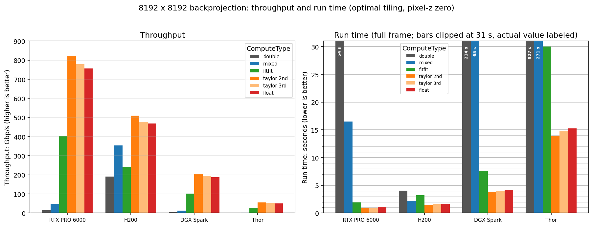
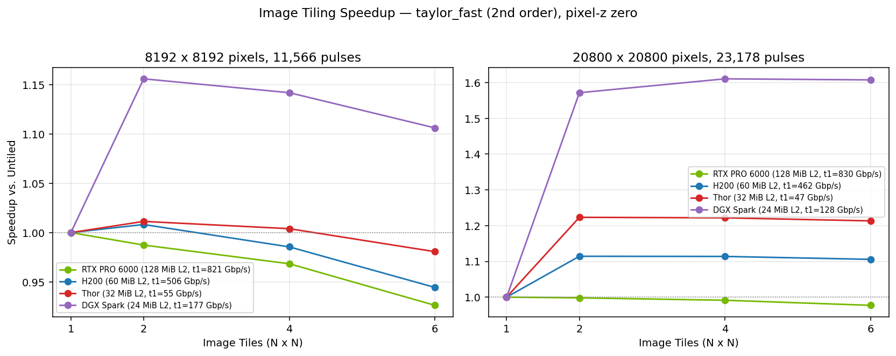
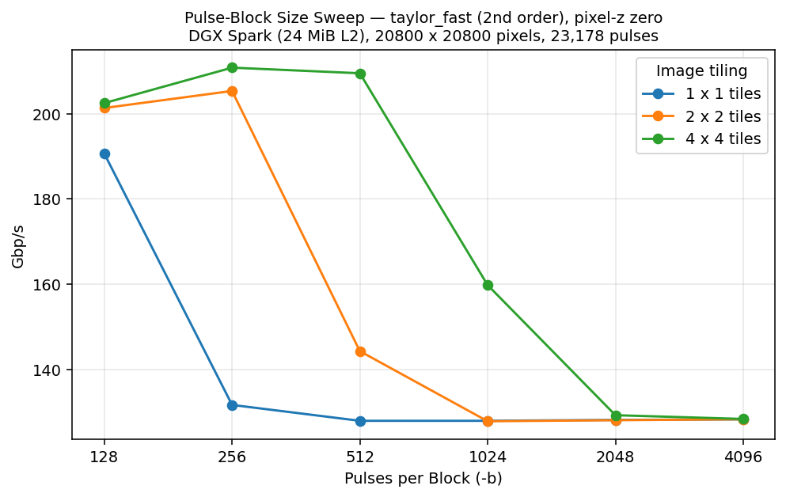

# SAR Backprojection Example

This example forms a SAR (Synthetic Aperture Radar) image from publicly available CPHD (Compensated Phase History Data) using
the MatX `sar_bp` operator on the GPU. This is meant to provide a working example to demonstrate the `sar_bp` operator
as well as to provide a useful application for collecting and sharing benchmark data.

This project will download and install additional third-party open source software projects.
Review the license terms of these open source projects before use.

The workflow has several steps:

1. **Data Acquisition**: Download a data set of interest
2. **Python virtual env**: Setup a Python virtual environment (venv)
3. **Python preprocessing**: Convert a `.cphd` file into a `.sarbp` binary input file
4. **Build**: Build the `sarbp` executable
5. **GPU backprojection**: Run the `sarbp` executable to form the image
6. **Visualization**: View the reconstructed image, or otherwise consume the output image

## 1. Download SAR Data

SAR datasets in CPHD format are available from several providers:

- **Umbra** https://umbra.space/open-data (https://registry.opendata.aws/umbra-open-data)
- **Capella** https://www.capellaspace.com/community/ (https://registry.opendata.aws/capella_opendata)

Review the licensing terms of the available data sets prior to use.

One way to download these data sets is to use the AWS CLI available via most Linux package managers. For example, if the AWS CLI is installed, the following downloads the `.cphd` file used in this demo to your current working directory:

```
aws s3 cp s3://umbra-open-data-catalog/sar-data/task-data/0f1231be-26d3-4b98-96ab-f675a5375c14/2026-02-20-03-03-38_UMBRA-07/2026-02-20-03-03-38_UMBRA-07_CPHD.cphd --no-sign-request .
```

Note that these files are large and there will be large intermediate and final image files produced during the subsequent steps. The `.cphd` file is ~31 GiB and the intermediate binary data file will be approximately the same size if using all pulses. The default processing performed in this examples uses only a subset of the pulses to keep intermediate data sizes and image sizes more manageable.

## 2. Set Up the Python Environment

Create a virtual environment and install the required packages (`sarpy` and its dependencies). You can use the included `requirements.txt`, or just `pip install sarpy` if you prefer potentially newer packages.

```bash
# From examples/sarbp directory
python3 -m venv venv
source venv/bin/activate
pip install -r requirements.txt
```

`sarpy` is the CPHD reader.

## 3. Convert CPHD to `.sarbp` Format

Run the conversion script to generate a binary input image from the `.cphd` file. 

```bash
python cphd_to_sarbp_input.py /path/to/file.cphd -o sarbp_input.sarbp
```

This writes a `.sarbp` file (`sarbp_input.sarbp` in the example) that packages the phase history,
platform positions, and image grid parameters into a single binary.

### Common options

| Flag | Description |
|------|-------------|
| `-o OUTPUT` | Output file path (default: input path with `.sarbp` extension) |
| `--image-size N` | Output image size in pixels, square (default: auto from scene extent) |
| `--pixel-spacing M` | Pixel spacing in meters (default: auto, 25% oversampled) |
| `--pulse-stride N` | Use every Nth pulse for faster processing (default: 1) |
| `--max-pulses N` | Limit total number of pulses (default: all) |
| `--doppler-filter` | Enable Doppler prefilter (off by default) |
| `--aperture-angle DEG` | Max angle from closest approach for pulse selection (default: 0.7 degrees) |

**Example**: Create a data set to form an 8192x8192 image using one degree of data:

```bash
python cphd_to_sarbp_input.py /path/to/file.cphd --image-size 8192 --aperture-angle 1.0 -o input_8k.sarbp
```

The `--aperture-angle` flag is the easiest way to control data volumes. Increasing the aperture angle will add more pulses and the increased cross-range resolution will reduce pixel pitch, increasing pixel count. We chose a default value to produce reasonably sized images and data sets for this demo, but users can explore different configurations. Also, other CPHD files / collections may require different values.

## 4. Build the `sarbp` Executable

Build MatX with examples enabled:

```bash
# From MatX base directory
mkdir -p build && cd build
cmake .. -DMATX_BUILD_EXAMPLES=ON -DCMAKE_BUILD_TYPE=Release
make -j sarbp
```

## 5. Run Backprojection

```bash
./examples/sarbp /path/to/input.sarbp -o output_image.raw
```

The output is a raw binary file of single-precision complex floats (interleaved
real/imag, row-major), written to `output_image.raw` in this example.

### Common options

| Flag | Description |
|------|-------------|
| `-o OUTPUT` | Output file path (default: input with `.raw` extension) |
| `-u N` | Range upsample factor via zero-padding (default: 1) |
| `-w {hamming,none}` | Window for range compression (default: hamming) |
| `-b {auto,all,0,N}` | Pulses per processing block. `auto` uses the GPU L2 cache size to choose a block size; `all` and `0` use all pulses (default: auto) |
| `--image-tiles N` | Process the image as N x N tiles during backprojection (default: 1) |
| `--taylor-fast-third-order` | Add the third-order range term when using `--precision taylor_fast` |
| `--precision {double,float,fltflt,mixed,taylor_fast}` | Backprojection compute precision (default: mixed) |
| `--pixel-z {variable,zero,fixed}` | Compile-time assumption for the pixel Z coordinate. `zero` skips per-pixel Z work and is valid (and faster) for a flat, Z=0 image grid like this example's (default: variable) |
| `--warmup` | Warmup GPU kernels and FFT plans before timed run |
| `--gold FILE` | Validate the output against a golden image (raw `complex<float>`, same format the example writes) and report accuracy metrics (3x3-window correlation and signal-to-error ratio) |
| `--cmap FILE` | Write the correlation map (raw `float32`) to a file; requires `--gold` |

The `--precision` flag controls the arithmetic used by the `sar_bp` operator. For spaceborne SAR, `float` does not provide enough precision to store fractional wavelengths at the range-to-MCP magnitudes (hundreds of km), so pure `float` is not sufficient to produce focused images. The available modes are:

- `double` -- full double-precision arithmetic. Most accurate.
- `mixed` -- double-precision for range computation, single-precision elsewhere. Default. Close to `double` in image quality with slightly higher throughput on GPUs with reduced double-precision throughput. Among the reference-quality modes it is the fastest on hardware with full-throughput double-precision (e.g., A100, H100/H200, B200); the approximate `taylor_fast` mode is faster still.
- `fltflt` -- float-float evaluation using two `float` values for the high-precision range math. Significantly higher throughput on GPUs where `double` throughput is reduced (e.g., RTX PROs, Jetson Orin/Thor, gaming GPUs).
- `taylor_fast` -- local Taylor approximation of the pulse-to-pixel range about a centered per-thread-block reference point. Highest-throughput experimental mode for spaceborne SAR geometries where moderate approximation error is acceptable.
- `float` -- single-precision throughout. Fastest but not accurate enough for most spaceborne data.

See the Performance and Accuracy section below for performance data and recommendations on a variety of GPUs.

## 6. View the Result

The images will be large. Above, we by default created an image of approximately 9000 x 9000 pixels, but you could also create 20000 x 20000 image or larger. The example provides a simple matplotlib-based script for quick viewing, but most uses will require a more robust viewer designed for SAR imagery, or at least designed to handle large images. Note that saving to a `.png` in particular downsamples the image and writes an image of ~1500x1500 pixels.

Display the image interactively:

```bash
python view_sarbp_image.py /path/to/file.raw
```

Or save directly to a PNG:

```bash
python view_sarbp_image.py /path/to/file.raw --save image.png
```

The script determines image dimensions in this order:

1. `--size HxW` if provided
2. Companion `.sarbp` file (same base name, or via `--sarbp`)
3. Assumes a square image from the file size

| Flag | Description |
|------|-------------|
| `--sarbp FILE` | Path to `.sarbp` file for reading dimensions (width/height and pixel size) |
| `--size HxW` | Image dimensions (overrides `.sarbp` header) |
| `--percentile LO,HI` | Percentile-based contrast stretch on the dB image (default: `5,95`) |
| `--dynamic-range DB` | Use a fixed dB-below-peak floor instead of the percentile stretch |
| `--save FILE` | Save to file instead of displaying |
| `--cmap NAME` | Matplotlib colormap (default: gray) |

By default the viewer applies a percentile-based contrast stretch: it computes the 5th and 95th percentiles of the dB-scaled image and uses those as the colormap's vmin/vmax. This prevents a small number of bright scatterers (specular returns from buildings, corner reflectors, etc.) from dominating the dynamic range and washing the rest of the scene to black. A fixed dB-below-peak floor (`--dynamic-range`) is available as an override, but the percentile stretch is generally the more useful default for inspecting these images.

Below is the image generated for the 8192 x 8192 reconstruction using `python view_sarbp_image.py /path/to/file.raw --save image.png`.
The scene is Hartsfield-Jackson Atlanta International Airport. The terminals are the vertical structures and the runways around the
airport are clearly visible.


## Performance and Accuracy

This section summarizes `sar_bp` throughput and image accuracy across the available `--precision` compute types and several GPUs. The intent is to help choose a compute type for a given GPU and to illustrate the accuracy/throughput trade-offs of each mode.

### Benchmark configuration

All results use the Umbra open-data collection referenced above, processed into two image sizes that span a "small" and a "large" spotlight frame:

| Scene | Ground extent | Pixel (GSD) | Aperture | Pulses | Giga backprojections (Gbp) |
|------|---------------|-------------|----------|--------|------------------------|
| 8192 x 8192 | ~5.73 km | 0.699 m | 1.0° | 11,566 | 776 |
| 20800 x 20800 | ~8.22 km | 0.395 m | 2.0° | 23,178 | 10,028 |

A backprojection is the unit of computation required for a single pixel-pulse contribution. For the "small" scene, there are 8192 x 8192 x 11566 = 776.18 billion backprojections, or ~776 giga backprojections. Both scenarios are X-band (9.6 GHz), ~770 km slant range, ~43° grazing angle. All runs use `--warmup` and `--pixel-z zero` (the image grid is planar at Z=0, so `zero` is exact here and is a few percent faster than `variable`). Throughput is reported with the optimal `--image-tiles` for each configuration and the default `-b auto`, which selects a 256-pulse block for this data on every GPU tested (see [Image Tiling](#image-tiling)). As the [Pulse-block size](#pulse-block-size) section shows, `-b` is itself a significant knob, so a manually tuned `(--image-tiles, -b)` pair can exceed these `-b auto` rates on some GPUs.

> **Note:** All compute types except `double` use the phase lookup-table (PhaseLUT) optimization, which precomputes the per-range-bin phase ramp once and then applies a per-pixel per-pulse correction. `double` runs without PhaseLUT as it operates as the reference for accuracy comparisons.

Metric definitions:

- **Gbp/s**: Giga-backprojections per second = (image pixels x pulses) / backprojection-kernel time. The primary throughput metric.
- **Time**: The backprojection-kernel time for the full image (= Gbp / rate). Range compression (FFTs) and host transfers are excluded.
- **SER**: Signal-to-error ratio in dB versus a `double`-precision reference image: `10*log10( sum|gold|^2 / sum|image - gold|^2 )`.
- **Min / 1% correlation**: The minimum and 1st-percentile values of a 3x3-window complex coherence (`corrmap`) between the image and the `double` reference. 1.0 is a perfect match.

The SER and correlation numbers are produced by the example's own `--gold`/`--cmap` validation. They are independent of GPU, and -- for every mode except `taylor_fast` -- independent of tiling, so they are reported once per (scene, compute type). The values below are for the untiled (1 tile) configuration; `taylor_fast` shifts by at most ~0.04 dB SER under tiling (see [Image Tiling](#image-tiling)), which does not change its rounded entries in the table. The `double` mode is the reference, so it has no SER/correlation of its own.

### Accuracy by compute type

| ComputeType | SER (8k) | min corr (8k) | 1% corr (8k) | SER (20k) | min corr (20k) | 1% corr (20k) |
|-------------|---------:|--------------:|-------------:|----------:|---------------:|--------------:|
| `double` (reference) | -- | -- | -- | -- | -- | -- |
| `mixed` | 102.0 dB | 0.99999958 | 0.99999982 | 101.8 dB | 0.99999952 | 0.99999982 |
| `fltflt` | 101.3 dB | 0.99999958 | 0.99999982 | 101.2 dB | 0.99999958 | 0.99999982 |
| `taylor_fast` (2nd) | 87.2 dB | 0.99999881 | 0.99999982 | 91.0 dB | 0.99999958 | 0.99999982 |
| `taylor_fast` (3rd) | 87.2 dB | 0.99999881 | 0.99999982 | 91.0 dB | 0.99999958 | 0.99999982 |
| `float` | -1.8 dB | 3.0e-5 | 0.026 | -2.2 dB | 1.9e-5 | 0.021 |

Observations:

- `float` is not usable for these spaceborne geometries: a negative SER and near-zero correlation mean the image is effectively decorrelated from the reference. It is included only to make the point concrete. Note that `float` is a bit of a misnomer since `fltflt` and `taylor_fast` also use float, but with compensated arithmetic and reformulations to maintain accuracy. `float` is a direct single-precision implementation with no attempt to improve accuracy.
- `taylor_fast` is the fastest mode at slightly reduced accuracy (87-91 dB SER, still > 0.99999 correlation). Its accuracy improves on the larger/wider-aperture frame because each patch of pixels that corresponds to a CUDA thread block covers a smaller spatial extent. The third-order term provides no measurable accuracy gain over second order here, and is slightly slower, so second order is the better default. The third-order Taylor term is useful for short-range imaging scenarios; see https://nvidia.github.io/MatX/api/signalimage/radar/sar_bp.html#taylorfast-range-approximation for details.
- `mixed` and `fltflt` are both essentially reference-quality (~100+ dB SER, correlation > 0.9999995). It is the `PhaseLUT` optimization that caps these accuracy values. For example, `mixed` without `PhaseLUT` produces an SER of 127 dB, albeit at reduced performance. We do have options for optimized implementations at higher accuracy levels (> 100 dB), but it is unclear if they are needed. If you have a use case that requires higher accuracy than is provided by the current optimized variants, then please file a MatX issue with details or reach out to the developers.

### Throughput by compute type

The figure below summarizes throughput (Gbp/s) and full-frame run time across GPUs and ComputeTypes. The underlying per-configuration run times -- including the `--pixel-z variable` vs `zero` comparison -- are tabulated in the [Appendix](#appendix-per-configuration-run-times).



*Left: throughput (Gbp/s), a normalized metric that is largely independent of scene size. Right: wall-clock run time for the full 8192 x 8192 frame -- run time is work / throughput, so a larger frame takes proportionally longer. The run-time axis is clipped at 31 s so the fast modes stay legible; bars that exceed the cap are drawn full-height and labeled with their actual run time. On platforms other than the H200, the `fltflt` and `taylor_fast` modes are far faster (and far lower run time) than `double`/`mixed`.*

Observations:

- `taylor_fast` (2nd order) is the throughput leader on every GPU and is the right choice when its ~87-91 dB SER is acceptable. Note that although we see 10+ dB SER difference between `taylor_fast` and `fltflt`/`mixed`, the minimum and 1% correlation values are still very close to 1. `taylor_fast` uses FP32 for inner loop calculations, which makes it fast on all GPUs.
- If higher accuracy is needed, the best compute type is GPU-dependent:
  - On GPUs with full-rate FP64 (e.g. H200), `mixed` is both accurate and fast.
  - On GPUs with reduced FP64 (e.g. RTX PRO 6000, DGX Spark, Thor), `fltflt` recovers near-`double` accuracy using all-FP32 math.

Our recommendation is to use `taylor_fast` for maximum throughput, and `mixed` (on full-FP64 GPUs) or `fltflt` (elsewhere) when near-reference accuracy is required.

### Image tiling

`--image-tiles N` processes the image as an N x N grid of sub-tiles, one backprojection launch per tile. Its value is purely a cache-locality effect. In backprojection the reused data is the per-pulse range profiles; each output pixel reads two samples per pulse indexed by range to the platform. Neighboring pixels reuse overlapping range bins, and that reuse has to stay resident in L2 to be cheap. A larger scene sweeps a wider span of range bins before a given bin is reused, and once that working set exceeds L2 the misses fall through to DRAM and the (memory-bound) fast modes stall. Tiling shrinks each launch's range-bin working set back under L2, restoring the hit rate.

This makes the benefit a function of L2 size vs. scene size:



- Smaller L2 -> larger benefit. On the 20800 x 20800 scene, `taylor_fast` recovers about +61% on the DGX Spark (24 MiB L2) and +22% on Thor (32 MiB), a milder +11% on the H200 (60 MiB), and nothing on the RTX PRO 6000 (128 MiB).
- The benefit also depends on scene size. The smaller 8192 x 8192 frame has a smaller working set, so only the DGX Spark (with the smallest L2 cache) gains from tiling there (+16%); Thor, H200, and PRO 6000 are flat because their larger L2 already holds it. Tiling matters most when the scene working set exceeds L2. Although the range profiles are most important in terms of L2 hit rates, note that `PhaseLUT` entries and image pixels will also be stored in L2 cache, so it is best to test multiple tiling factors on a given GPU rather than simply compute the range profile working set size and compare that to the L2 cache to determine optimal tiling.
- It only helps the memory-bound modes. `taylor_fast`, `float`, and (partly) `fltflt` benefit; the compute-bound `double`/`mixed` are flat because their FP64/extended-precision work already hides the memory latency.
- Over-tiling hurts. Once L2 pressure is relieved, finer tiling only adds launch overhead and other inefficiencies.

For most modes, tiling has no impact on the backprojection result and should be bit-equivalent to a non-tiled backprojection on the same GPU. However, there can be a small impact for some pixels for `taylor_fast`. This is because introducing tile boundaries can yield slightly different reference range locations for the boundary tiles (the reference range is to the center of a thread block, but that thread block may be smaller due to the tile boundary). In these cases, the spatial extent of the thread block is smaller and thus the approximations will be slightly more accurate. The impact is small (0.01-0.04 dB SER).

### Pulse-block size

The pulses are processed in blocks (`-b`), and the block size is a second lever on L2 behavior that works alongside image tiling. The two knobs shrink the L2 working set for range profiles using two domain decompositions:

- Image tiling shrinks the per-pulse range swath that needs to be L2-resident by restricting the backprojection to a more compact range swath.
- Pulse blocking shrinks the number of pulses that need to be L2-resident per kernel launch.

Because both compete for the same L2, the optimal block size depends on the tiling factor. The plot below sweeps `-b` at three tiling factors on the DGX Spark (24 MiB L2), 20800 x 20800, `taylor_fast` (2nd order), `--pixel-z zero`:



- While pulse blocking alone may be sufficient for GPUs with more L2 cache, both image tiling and pulse blocking are beneficial for smaller L2 caches.
- The current auto-blocking (`-b auto`) logic chooses a minimum of 256 pulses, but without image tiling 128 pulses would be more optimal on DGX Spark. The most optimal point in this sweep uses 4 x 4 image tiling and 256 pulses per pulse block.

The automatic pulse blocking / image tiling logic in the `sarbp` example may change over time, but users can always manually sweep using `--image-tiles` and `-b`.

## Appendix: Per-configuration run times

Full-frame backprojection run times in seconds for every GPU and ComputeType, using the optimal `--image-tiles` per configuration and the default `-b auto` (see [Image Tiling](#image-tiling)). Each cell is `pixel-z variable / pixel-z zero`; `zero` is exact for this planar Z=0 grid and is the value plotted in the figure above. Throughput in Gbp/s can be recovered as (work) / (run time), where the work is 776.2 Gbp for the 8192 x 8192 frame and 10,027.7 Gbp for the 20800 x 20800 frame. `n/r` = not run (`double` at 20k on Thor would take ~3.5 hours).

<h4 align="center">8192 x 8192 pixels, 11,566 pulses</h4>

| ComputeType | RTX PRO 6000 | H200 | DGX Spark | Thor |
|-------------|--------------|------|-----------|------|
| `double` | 54.31 / 54.29 | 4.22 / 4.06 | 214 / 214 | 927 / 927 |
| `mixed` | 17.48 / 16.50 | 2.24 / 2.20 | 68.52 / 64.62 | 287 / 271 |
| `fltflt` | 2.13 / 1.93 | 3.50 / 3.22 | 8.45 / 7.65 | 33.08 / 30.04 |
| `taylor_fast` (2nd) | 0.98 / 0.95 | 1.70 / 1.52 | 3.92 / 3.79 | 14.33 / 13.91 |
| `taylor_fast` (3rd) | 1.03 / 1.00 | 1.70 / 1.62 | 4.14 / 3.99 | 15.14 / 14.76 |
| `float` | 1.04 / 1.03 | 1.69 / 1.65 | 4.17 / 4.14 | 15.89 / 15.29 |

<h4 align="center">20800 x 20800 pixels, 23,178 pulses</h4>

| ComputeType | RTX PRO 6000 | H200 | DGX Spark | Thor |
|-------------|--------------|------|-----------|------|
| `double` | 701 / 701 | 54.48 / 52.33 | 2762 / 2761 | n/r |
| `mixed` | 226 / 213 | 28.86 / 28.26 | 846 / 802 | 3699 / 3505 |
| `fltflt` | 27.70 / 25.31 | 45.14 / 41.59 | 111 / 103 | 427 / 388 |
| `taylor_fast` (2nd) | 12.47 / 12.08 | 21.52 / 19.47 | 49.82 / 48.46 | 178 / 173 |
| `taylor_fast` (3rd) | 13.23 / 12.78 | 21.94 / 20.91 | 53.29 / 50.80 | 191 / 186 |
| `float` | 13.48 / 13.34 | 21.90 / 21.41 | 53.36 / 53.45 | 205 / 197 |
