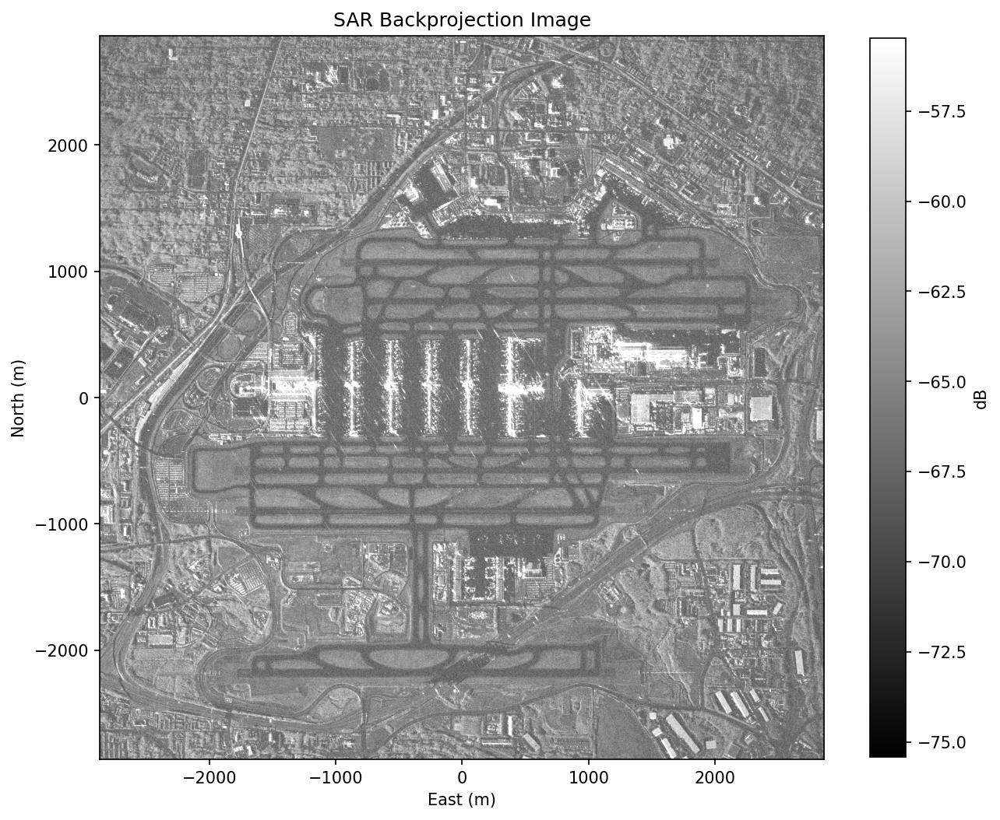

# SAR Backprojection Example

This example forms a SAR (Synthetic Aperture Radar) image from publicly available CPHD (Compensated Phase History Data) using
the MatX `sar_bp` operator on the GPU. This is meant to provide a working example to demonstrate the `sar_bp` operator
as well as to provide a useful application for collecting and sharing benchmark data.

This project will download and install additional third-party open source software projects.
Review the license terms of these open source projects before use.

The workflow has several steps:

1. **Data Acquistion**: Download a data set of interest
1. **Python preprocessing**: Convert a `.cphd` file into a `.sarbp` binary input file
2. **GPU backprojection**: Run the `sarbp` executable to form the image

## 1. Download SAR Data

SAR datasets in CPHD format are available from several providers:

- **Umbra** https://umbra.space/open-data (https://registry.opendata.aws/umbra-open-data)
- **Capella** https://www.capellaspace.com/community/ (https://registry.opendata.aws/capella_opendata)

Review the licensing terms of the available data sets prior to use.

One way to download these data sets is to use the AWS CLI available via most Linux package managers. For example, if the AWS CLI is installed, the following downloads the `.cphd` file used in this demo to your current working directory:

```
aws s3 cp s3://umbra-open-data-catalog/sar-data/task-data/0f1231be-26d3-4b98-96ab-f675a5375c14/2026-02-20-03-03-38_UMBRA-07/2026-02-20-03-03-38_UMBRA-07_CPHD.cphd --no-sign-request .
```

Note that these files are large and there will be large intermediate and final image files produced during the subsequent steps. The `.cphd` file is ~31 GiB and the intermediate binary data file will be approximately the same size if using all pulses. The default processing performed in this examples uses only a subset of the pulses to keet intermediate data sizes and image sizes more manageable.

## 2. Set Up the Python Environment

Create a virtual environment and install the required packages:

```bash
python3 -m venv venv
source venv/bin/activate
pip install sarpy matplotlib numpy lxml
```

`sarpy` is the CPHD reader. `matplotlib` is optional but useful for visualizing results.

## 3. Convert CPHD to `.sarbp` Format

Run the conversion script to generate a binary input image from the `.cphd` file. 

```bash
python cphd_to_sarbp_input.py /path/to/file.cphd -o sarbp_input.sarbp
```

This writes a `.sarbp` file (`sarbp_input.sarbp` in the example) that packages the phase history,
platform positions, and image grid parameters into a single binary.

### Common options

| Flag | Description |
|------|-------------|
| `-o OUTPUT` | Output file path (default: input path with `.sarbp` extension) |
| `--image-size N` | Output image size in pixels, square (default: auto from scene extent) |
| `--pixel-spacing M` | Pixel spacing in meters (default: auto, 25% oversampled) |
| `--pulse-stride N` | Use every Nth pulse for faster processing (default: 1) |
| `--max-pulses N` | Limit total number of pulses (default: all) |
| `--doppler-filter` | Enable Doppler prefilter (off by default) |
| `--aperture-angle DEG` | Max angle from closest approach for pulse selection (default: auto) |

**Example**: Create a data set to form an 8192x8192 image using one degree of data:

```bash
python cphd_to_sarbp_input.py /path/to/file.cphd --image-size 8192 --aperture-angle 1.0 -o input_8k.sarbp
```

The `--aperture-angle` flag is the easiest way to control data volumes. Increasing the aperture angle will add more pulses and the increased cross-range resolution will reduce pixel pitch, increasing pixel count. We chose a default value to produce reasonably sized images and data sets for this demo, but users can explore different configurations. Also, other CPHD files / collections may require different values.

## 4. Build the `sarbp` Executable

Build MatX with examples enabled:

```bash
# From MatX base directory
mkdir -p build && cd build
cmake .. -DMATX_BUILD_EXAMPLES=ON -DCMAKE_BUILD_TYPE=Release
make -j sarbp
```

## 5. Run Backprojection

```bash
./examples/sarbp /path/to/input.sarbp -o output_image.raw
```

The output is a raw binary file of single-precision complex floats (interleaved
real/imag, row-major), written to `output_image.raw` in this example.

### Common options

| Flag | Description |
|------|-------------|
| `-o OUTPUT` | Output file path (default: input with `.raw` extension) |
| `-u N` | Range upsample factor via zero-padding (default: 1) |
| `-w {hamming,none}` | Window for range compression (default: hamming) |
| `-b N` | Pulses per processing block to limit GPU memory (default: all) |
| `--precision {double,float,fltflt,mixed}` | Backprojection compute precision (default: mixed) |
| `--warmup` | Warmup GPU kernels and FFT plans before timed run |

The `--precision` flag controls the arithmetic used by the `sar_bp` operator. For spaceborne SAR, `float` does not provide enough precision to store fractional wavelengths at the range-to-MCP magnitudes (hundreds of km), so pure `float` is not sufficient to produce focused images. The available modes are:

- `double` -- full double-precision arithmetic. Most accurate.
- `mixed` -- double-precision for range computation, single-precision elsewhere. Default. Close to `double` in image quality with slightly higher throughput on GPUs with reduced double-precision throughput. Other than `float`, this is the fastest option on hardware with full-throughput double-precision (e.g., A100, H100/H200, B200).
- `fltflt` -- float-float evaluation using two `float` values for the high-precision range math. Significantly higher throughput on GPUs where `double` throughput is reduced (e.g., RTX PROs, Jetson Orin/Thor, gaming GPUs).
- `float` -- single-precision throughout. Fastest but not accurate enough for most spaceborne data.

## 6. View the Result

The images will be large. Above, we by default created an image of approximately 9000 x 9000 pixels, but you could also create 20000 x 20000 image or larger. The example provides a simple matplotlib-based script for quick viewing, but most uses will require a more robust viewer designed for SAR imagery, or at least designed to handle large images. Note that saving to a `.png` in particular downsamples the image and writes an image of ~1500x1500 pixels.

Display the image interactively:

```bash
python view_sarbp_image.py /path/to/file.raw
```

Or save directly to a PNG:

```bash
python view_sarbp_image.py /path/to/file.raw --save image.png
```

The script determines image dimensions in this order:

1. `--size HxW` if provided
2. Companion `.sarbp` file (same base name, or via `--sarbp`)
3. Assumes a square image from the file size

| Flag | Description |
|------|-------------|
| `--sarbp FILE` | Path to `.sarbp` file for reading dimensions (width/height and pixel size) |
| `--size HxW` | Image dimensions (overrides `.sarbp` header) |
| `--dynamic-range DB` | Display range in dB below peak (default: 60) |
| `--save FILE` | Save to file instead of displaying |
| `--cmap NAME` | Matplotlib colormap (default: gray) |

Below is the image generated for the 8192 x 8192 reconstruction using `python view_sarbp_image.py /path/to/file.raw --save image.png`.
The scene is Hartsfield-Jackson Atlanta International Airport. The terminals are the vertical structures and the runways around the
airport are clearly visible.

